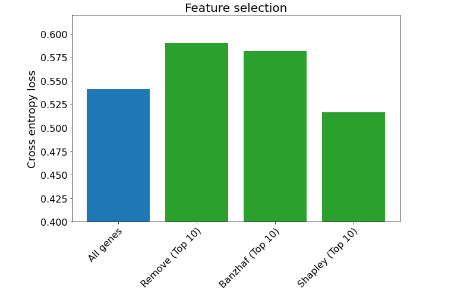
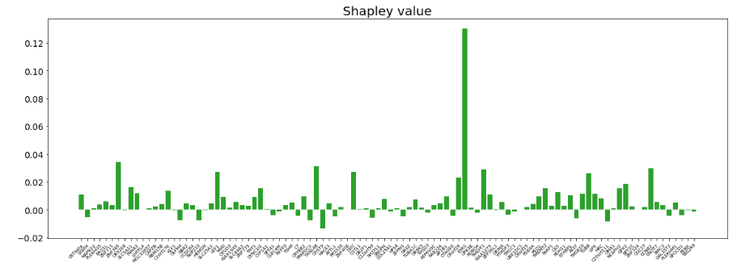

# Explainable AI for Breast Cancer Detection and Analysis

## Overview
This project demonstrates the use of Explainable AI techniques in analyzing and detecting breast cancer. **By leveraging advanced algorithms, the project aims to make machine learning predictions more transparent and actionable for medical professionals.** 

### Key Features
- **Explainability with SHAP, Banzhaf, and Remove Explanations Library:** Utilizes Shapley values, Banzhaf power index, and individual removal methods to explain model predictions.
- **Breast Cancer Detection:** Implements predictive models for breast cancer diagnosis using well-established datasets.
- **Interpretation and Analysis:** Provides detailed visualizations and explanations to help users understand the model's behavior and important features.

---

## Significance

### Medical Impact
**Early and accurate detection of breast cancer** can significantly improve patient outcomes. This project provides:
- **Transparency in Decision-Making:** Enables medical professionals to understand why a model makes a certain prediction, building trust in AI systems.
- **Feature Importance Analysis:** Highlights the most critical factors influencing predictions, guiding clinicians toward key diagnostic indicators.

### Ethical and Practical Relevance
- **Accountability:** Ensures that AI-driven decisions in healthcare are understandable and justifiable.
- **Adoption:** Facilitates wider acceptance of AI tools by addressing the "black-box" nature of machine learning models.

---

## Key Libraries Used
- [SHAP](https://github.com/slundberg/shap): For generating Shapley explanations.
- [Banzhaf](https://pypi.org/project/banzhaf/): For computing Banzhaf power indices.
- Remove Explanations Library: For individual feature removal impact analysis.
- Scikit-learn: For machine learning models.
- Matplotlib/Seaborn: For visualizations.

## Result
Among feature selection methods, SHAP (Top 10) provided the lowest cross-entropy loss, demonstrating its effectiveness in identifying the most relevant features for prediction.

  

Sample of features which indicates the effectiveness of the feature in diagnosis of breast cancer based on the gene type using shapley values

  

